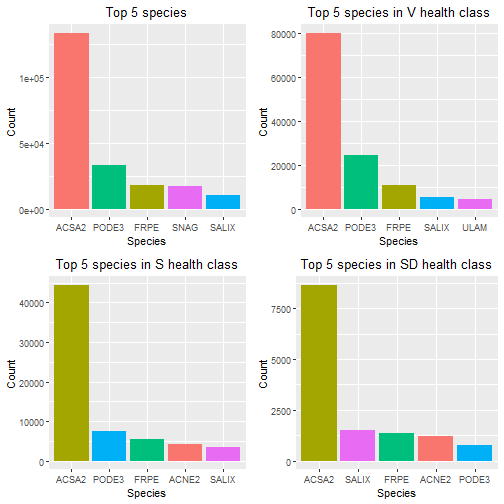

Floodplain Forest Group: Progress Report, Week 2
========================================================
author: Sal Balkus, Noah Dean, Makayla McDevitt 
date: 6/12/20
autosize: true
css: Week2-Presentation.css
type: section


Summary of Project
========================================================

```r
library(tidyverse)
library(gridExtra)
plots <- read_csv("clean_data/plots.csv")
```


Literature Review
========================================================


What we got out of the literature
========================================================


Data Cleaning
========================================================


Initial Questions
========================================================


Initial Questions
========================================================


Initial Questions
========================================================


Initial Questions
========================================================


Preparation for Analyzing by Plot
========================================================

- Function to filter out species that only appear in fewer than n plots
- Pivot table listing frequency, trees per acre, and relative trees per acre for each plot
  - dataset of plots, rather than trees; important for later
- Exploration of distributions for top 5 species:
  - Frequency and TPA very right-skewed with few high outliers; requires log-transform
  - Relative TPA [0-1] skewed either 0 or 1 (mostly 0)
  

ACSA2 Trees-per-acre distributions
========================================================



  
Main Questions Raised
========================================================

To explore:
- Which species appear together, and in what quantities?
- How does basal area and health vary among species within plots?
- What transformations should be used to deal with outliers?

To ask:
- How ecologically important are unique species?
- In how many plots should a species be present to be considered in our further analysis?


What are our next steps?
========================================================

Our goal now is to develop a way to classify plots based on forest type.

Level 1: define plots based on dominant species
- simple rules-based formula
- dominance based on basal area and density

Level 2: define using multivariate analyses of level 1 classes
- multivariate analysis
- clustering


What are our next steps?
========================================================

Tasks:
- Use R to determine dominant species for each plot, or if plot is codominant/mixed
- For mixed plots, research ordination methods to use for mixed plot classification
- Research clustering methods to use for level 2 classification


References
========================================================

Cover Image: Forest Landscape Ecology of the Upper Mississippi River Floodplain, United States Geological Survey

Floodplain Forest Classification Overview (Van Appledorn)
